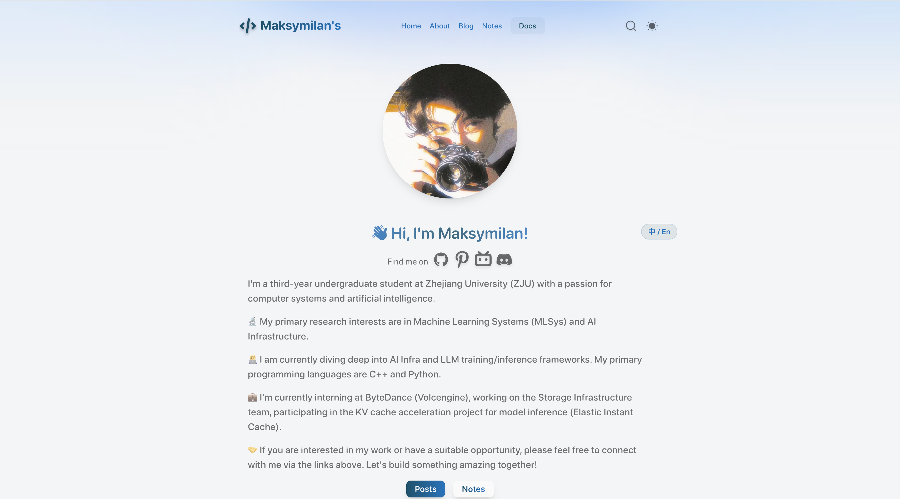
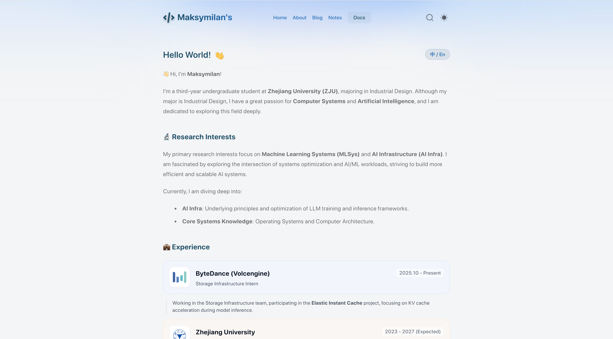
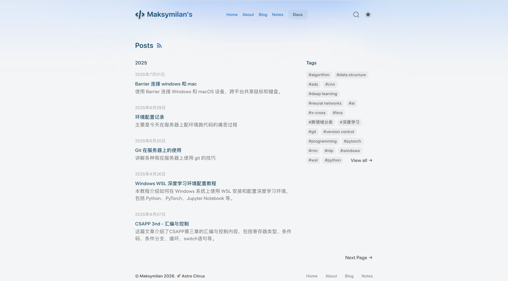

# Personal Website - Maksymilan

这是一个由 Astro 驱动的现代化个人网站项目，集成了个人简历、技术博客、学习笔记等功能。
本项目展示了如何利用 **AI Assisted Coding** 技术构建高效、优美的 Web 页面。

## ✨ 特性 (Features)

- **极速性能**: 基于 Astro 5 的静态站点生成 (SSG)，提供极致的加载速度和运行时性能。
- **现代化样式**: 使用 Tailwind CSS 构建的响应式设计，内置精美的日间/夜间（Dark Mode）主题切换。
- **内容驱动**: 深度集成 Markdown 和 MDX，支持在文章中直接嵌入动态组件。
- **学术与技术友好**: 
  - 内置 **KaTeX** 数学公式渲染，完美支持 LaTeX 语法。
  - 集成 **Shiki** 代码高亮，支持 diff 显示和行高亮。
  - 支持 **Admonitions** (提示块) 语法。
- **SEO 优化**: 自动生成 Sitemap, Robots.txt, 并利用 Satori 自动生成动态 Open Graph (OG) 社交分享图片。
- **全文搜索**: 集成 Pagefind 实现毫秒级的静态内容搜索体验。
- **Webmentions**: 支持去中心化的社交互动（评论与点赞）。

## 🛠️ 技术栈 (Tech Stack)

- **核心框架**: [Astro](https://astro.build/) (v5.0)
- **样式库**: [Tailwind CSS](https://tailwindcss.com/)
- **内容集合**: Astro Content Collections
- **图标库**: [Astro Icon](https://www.astroicon.dev/) (基于 Iconify)
- **Markdown 扩展**: remark-math, rehype-katex, remark-reading-time
- **代码质量**: Biome (Linting & Formatting)

## 📂 项目结构

```text
src/
├── assets/        # 静态资源 (字体, 图片)
├── components/    # 可复用组件 (Header, Footer, SEO, etc.)
├── content/       # 网站内容源文件 (Markdown/MDX)
│   ├── post/      # 博客文章
│   ├── note/      # 简短笔记
│   └── series/    # 系列文章配置
├── data/          # 静态数据文件
├── layouts/       # 页面布局模板
├── pages/         # 路由页面 (Astro 文件)
├── plugins/       # 自定义 Remark/Rehype 插件
├── styles/        # 全局样式
└── utils/         # 工具函数
```

## 📖 页面介绍

### 🏠 首页 (Home)
网站的入口，采用极简主义设计。包含：
- 动态背景效果
- 个人头像与简介
- 社交媒体链接聚合
- 最新发布的文章与笔记摘要
- 中英文内容切换（开发中）



### 👨‍💻 关于 (About)
详细展示个人信息与职业生涯。
- 教育背景 (ZJU)
- 研究兴趣 (MLSys, AI Infra)
- 实习与工作经历时间轴 (Experience Component)



### 📝 博客 (Blog) & 笔记 (Notes)
技术沉淀的核心区域。
- **博客**: 深度技术文章，支持系列（Series）归档，包含目录（TOC）、阅读时间预估等元信息。
- **笔记**: 碎片化的知识点记录，方便快速查阅。



## 🚀 快速开始 (Quick Start)

本项目使用 `pnpm` 进行包管理。

1. **安装依赖**
   ```bash
   pnpm install
   ```

2. **启动开发环境**
   ```bash
   pnpm dev
   ```
   访问 `http://localhost:4321` 即可预览。

3. **构建生产版本**
   ```bash
   pnpm build
   ```
   构建产物将位于 `dist/` 目录。

## 🤖 AI Coding 

本项目在开发全流程中深入应用了 AI 编程技术。主要体现在：
1. **代码生成**: 利用 AI 快速生成 Astro 组件结构与 Tailwind 样式类。
2. **逻辑优化**: 辅助编写 `utils` 中的数据处理逻辑与日期格式化函数。
3. **内容排版**: 协助配置 remark/rehype 插件生态，实现复杂的 Markdown 渲染需求。
4. **架构设计**: 为 content collections 设计类型安全的 schema 定义。

---
© 2026 Maksymilan. Built with Astro & AI.
