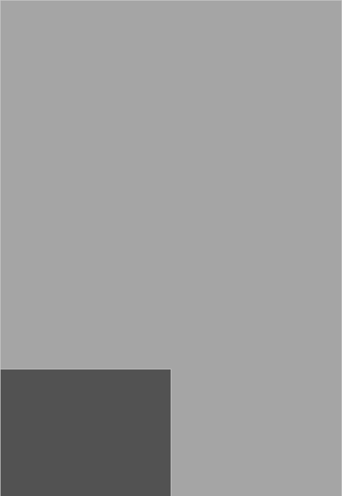
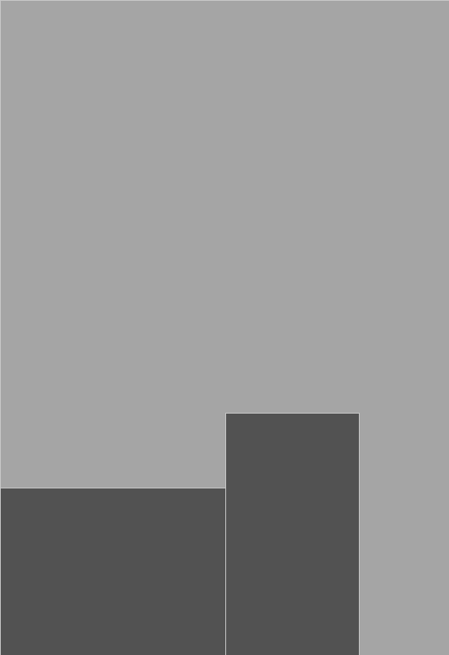
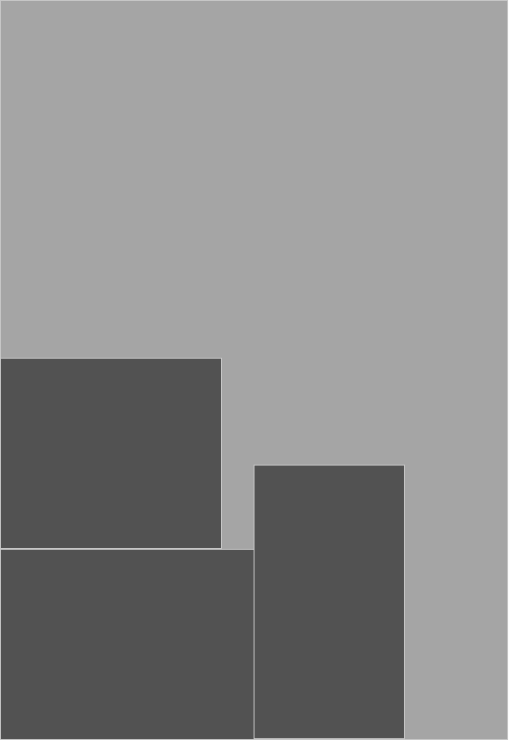
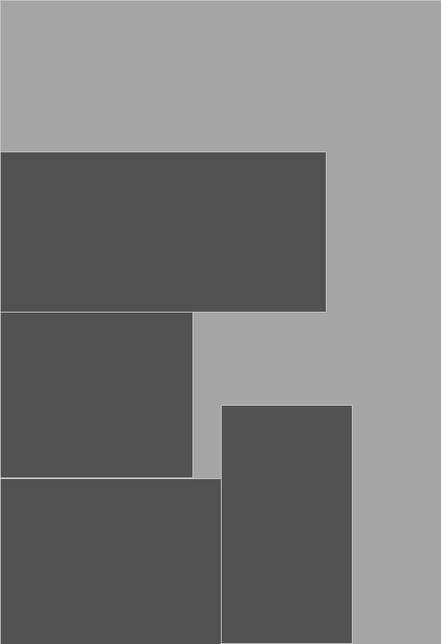
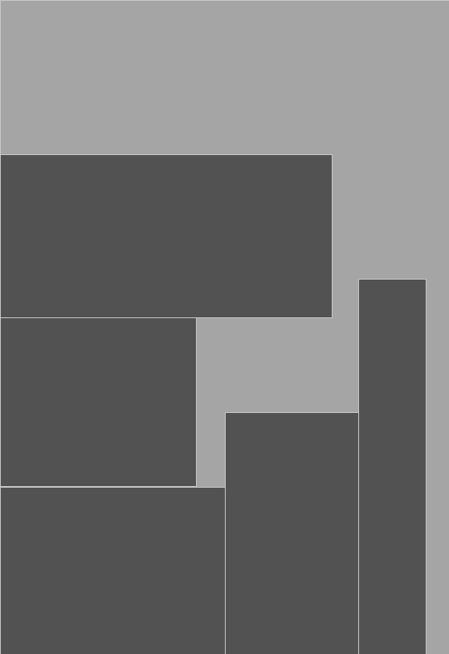
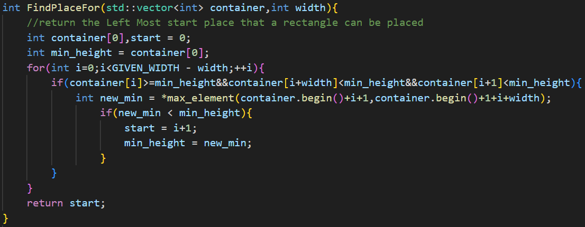
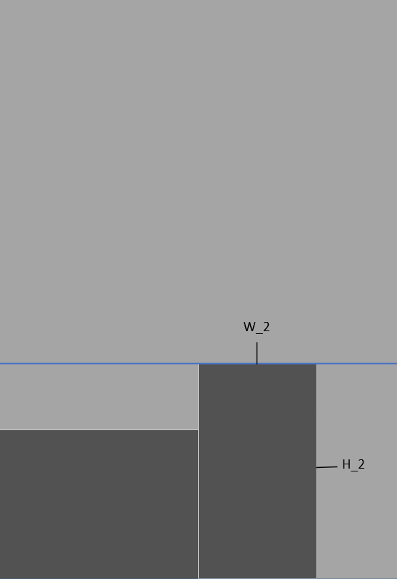

## Texture Packing
### Overall Preview
1. Problem Introduction
2. Solution Attempt
3. Testing Result
4. Complexity Analysis

<!--s-->
###  Problem Introduction
```Texture Packing is to pack multiple rectangle shaped textures into one large texture.  The resulting texture must have a given width and a minimum height.```
<!--v-->
###  What is the Nature of the Problem
```The Nature of this problem is How to fill a Rectangle box with given samll rectangles. And this is the two-dimensional case of Bin Packing```
<!--v-->

<div class="r-stack">
  
    
        
        
        
              
</div>

<!--s-->
### Our Solutions
```struct we will use ```
```cpp
    sturct Rectangle{
      int length;
      int width;
    }//we make sure that length is always longer than width;
    struct Container{
      int array[GIVENWIDTH];
    }
```
<!--v-->
### 1. Just place it in order
1. Recive rectangle
2. put it into container
```cpp[1|2|3|4|7-9|4|5|6|11|]
    Contaner C;//Construct a container to hold a rectangle, with an initial height of 0.
    Rectangle R;//Construct a rectangle for assignment.
    while(true){//The program will continue to run until the output is finished.
        R = GiveARectangle();//Receive a rectangle from input.
        if(R.IsNull()){//End of input.
            break;
        }else{
            PlaceRectangle(R,C);//Put the rectangle into the container and calculate the height of the container.
        }
    }
    std::cout<<C.CalculateHeight()<<std::endl;//Output the answer.
```
<!--v-->
### 2. Sort the rectangles in advance
<!--v-->
### 2.1 Sort the rectangles by length
1. First sort the rectangles by length, 
2. Insert them in the sorted order. 
```cpp[1-2|3|4|5-7|8|]
    Container C;//Construct a container to hold a rectangle, with an initial height of 0.
    std::vector<Rectangle> Recs;//This vector is used to contain all rectangles
    InputRectangles(Recs);//Input all rectangles into this vector
    SortByLength(Recs);//Sort the rectangles in vector by length
    for(Rectangle R:Recs){
      PlaceRectangle(R,C);//Put the rectangle into the container and calculate the height of the container.
    }
    std::cout<<C.CalculateHeight()<<std::endl;//Output the answer;
```
<!--v-->
### 2.2 sort the rectangle by width
1. First sort the rectangles by width, 
2. Insert them in the sorted order.
```cpp[1-2|3|4|5-7|8|]
    Container C;//Construct a container to hold a rectangle, with an initial height of 0.
    std::vector<Rectangle> Recs;//This vector is used to contain all rectangles
    InputRectangles(Recs);//Input all rectangles into this vector
    SortByWidth(Recs);//Sort the rectangles in vector by width
    for(Rectangle R:Recs){
      PlaceRectangle(R,C);//Put the rectangle into the container and calculate the height of the container.
    }
    std::cout<<C.CalculateHeight()<<std::endl;//Output the answer;
```
<!--v-->
### How does the function work
- void PlaceRectangles(Rectangle R,Container C)
  - We regard the width of the rectangle as a window that moves from left to right within the Container.Each time the window is moved by a unit length, it is only necessary to determine whether each movement will produce a new minimum maximum height.
- void SortByLength(std::vector<Rectangle> Recs)&void SortByWidth(std::vector<Rectangle> Recs)

<!--v-->
void PlaceRectangles();
```cpp[2|]
    void PlaceRectangles(Rectangle R,Container C){
      start = FindPlaceFor(R,C);//find the place to hold R;
      set(start,start+R.width,R.length);//all height between start and end index will add the length of rectangle
    }
```
<!--  -->
```cpp[2-3|4|5-7|8-10|13|]
    int FindPlaceFor(R,C){
      int MinHeight = C[0],Start = 0;
      //MinHeight represents the minimum value of the maximum height of all sliding windows
      for(int i=0;i<GIVENWIDTH-R.width;++i){
          if(Check(C,i,R.width)){
            //if ith element is about to disappear from the sliding window is equal to the current MinHeight, 
            //and the element((i+R.width)th) newly added to the sliding window is smaller than MinHeight
            int NewMin = Update(MinHeight);
            start = i+1;
            MinHeight = NewMin;
          }
        }
      return Start;
    }
```
<!--v-->
void SortByLength();
```cpp
    void SortByLength(std::vector<Rectangle> Recs){
      std::sort(Recs.begin(),Recs.end(),[](const Rectangle& a,const Rectangle& b){
        return a.length > b.length;
      })//Use the sort of the C++ standard library and the lambda function for sorting
    }
```
<!--v-->
### 3. Next Fit
1. Recive a rectangle
2. Check if previous container can hold it.
3. If precious container have enough space for the rectangle, put it into the container. Otherwise, calculate the Height of previous container and clean the container.
<!--v-->

```cpp[1-3|4|5-6|7|4|5-6|8-10|]
    int Container = 0;//We just need to know the loading width of the container
    Rectangle R;//To receive input rectangle
    int TotalHeight = 0;//Record the height
    while(inputRectangle(R)){
      if(HasPlace(Container,R)){
        //If previous Container has enough space, we put the rectangle into it directly
        PlaceRectangle(R,Container);
      }else{
        TotalHeight += CalculateHeight(Container);
        Container = 0;
      }
    }
    
```

<!--v-->
### 4. First Fit
1. Recive a rectangle
2. Find a container can hold the rectangle
3. If find a container, we put the rectangle into the container.Otherwise, we create a new container and put the rectangle into the new container 
<!--v-->
```cpp[1-2|3|4|5|13-14|15-16|3|4|5|6-7|8-9|10|]
    std::vector<int> ContainerArray;//every element represent the loading width of the container
    Rectangle R;//To receive input rectangle
    while(InputRectangle(R)){
      bool NeedNewContainer = True;
        for(auto Container:ContainerArray){
          if(HasPlace(Container,R)){
            //if we find a place to hold the container, we will directly put it into container.
            PlaceRectangle(R,C);
            NeedNewContainer = False;
            break;
          }
        }
        if(NeedNewContainer){
          //if we can't find a place for the rectangle, we create a new container, and put it into new container
          ContainerArray.push_back(0);
          PlaceRectangle(R,C);
        }
    }
```
<!--v-->
### 5. best Fit
1. Recive a rectangle
2. Search for every container, find the best positon for the rectangle to place. 
<!--v-->
```cpp[1-2|3|4|5|13|15-18|3|4|5|6-7|8-10|13|14|]
    std::vector<Container> ContainerArray;//every element represent the loading width of the container
    Rectangle R;//To receive input rectangle
    while(InputRectangle(R)){
      Container* Position = nullptr;//Record which container will be loaded.
        for(auto Container:ContainerArray){
          if(HasPlace(Container,R)){
            //if we find a place to hold the container, we will directly put it into container.
            if(IsBetterPosition(Container,R)){
            Position = &Container;
            }
          }
        }
        if(Position != nullptr){
          PlaceRectangle(R,*Pisition);//Put the rectangle to the best container;
        }else{
          //if we can't find a place for the rectangle, we create a new container, and put it into new container
          ContainerArray.push_back(0);
          PlaceRectangle(R,C);
        }
    }
```
<!--v-->
### How to define ***Best***?
```We use the proportion of container area used to measure the quality of the strategy  ```
<!--v-->

    
\
\
\
```The closer the ratio is to 1, the less space is wasted on padding.```\
\
\
$
P = \frac{\sum_{R \in Container}S_R}{Maxheight*GIVENWIDTH}
$

<!--v-->
### 6. Skyline Heuristic
```This algorithm is our code reproduction of the paper "A skyline heuristic for the 2D rectangular packing and strip packing problems" ```
1. Calculate the theoritical optimal solution
2. Set a upper bound and find solution.
3. If a solution is found, then this solution and the optimal solution are bisected as the new bound and return to (2.).Otherwise expand the upper bound return to (2.).
<!--v-->
```cpp[1-4|5-6|7-8|11-13|5-6|7-8|9-10|5-6|15|]
    int LB =  CalculateOptimalSolution();
    //Theratical optimal solution, equals to the sum of rectangle area divide the given width
    int UB = 2*LB;//Set a upper bound
    int Height = 0;//Record answer
    while(TimeNotExceed()&&UB != LB){
      //If time of the algorithm exceed the time we set or upper bound is equal to the LB, we will exit;
      if(FindSolution(UB)){
      //A heuristic algorithm, we use the code already implemented above
        Height = UB;
        UB = (UB + LB)/2;//Binary reduction
      }else{
        UB *= 2;
      }
    }
    return Height;
```
<!--s-->
### Testing Result


<!--s-->
### Complexity Analysis
<!--v-->
### Solution 1
<!--v-->
### Solution 2.1&Solution2.2
<!--v-->
### Solution 3
<!--v-->
### Solution 4
<!--v-->
### solution 5
<!--v-->
### Skyline Heuristic


<!--s-->
<h2 class="r-fit-text">THANKS FOR LISTENING</h2>